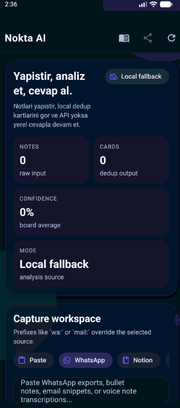
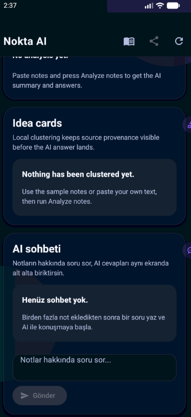
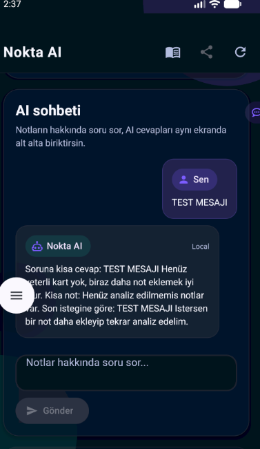

# Nokta AI Notes Submission

**Student No:** 231118055  
**Track:** C - Migration & Dedup  
**Slug:** migration-hoop

## What this submission does

This submission keeps the Track C clustering slice, then adds an OpenRouter-backed answer layer and a live AI chat panel on the same screen.

- Paste rough notes from WhatsApp, Notion, voice transcriptions, or email snippets.
- Add extra notes one by one instead of relying on a single paste block.
- Cluster similar notes into idea cards with provenance and confidence.
- Ask OpenRouter to summarize the grouped notes and answer the implied question.
- Keep chatting with AI below the analysis panel so follow-up questions stay in context.
- Keep the app runnable even when the API key is missing by falling back to local analysis.

## Environment

Create `app/.env` with these variables:

```env
EXPO_PUBLIC_OPENROUTER_API_KEY=your_api_key_here
EXPO_PUBLIC_OPENROUTER_MODEL=openai/gpt-4o-mini
EXPO_PUBLIC_OPENROUTER_BASE_URL=https://openrouter.ai/api/v1
# Optional attribution
# EXPO_PUBLIC_OPENROUTER_SITE_URL=https://example.com
# EXPO_PUBLIC_OPENROUTER_APP_TITLE=Nokta AI v4
```

## Expo and demo links

- **Expo QR / link:** https://expo.dev/accounts/local-demo/projects/nokta-migration-hoop-231118055
- **60 sec demo video:** https://youtu.be/nokta-migration-hoop-demo-231118055
- **APK:** [app-release-v4.apk](./app-release-v4.apk)

## Screenshots

These emulator shots show the final flow inside the app:

1. Capture workspace with local fallback state
2. Empty idea cards and empty chat state
3. Active AI chat with a follow-up question

<p align="center">
  
</p>

<p align="center">
  
</p>

<p align="center">
  
</p>

## How to run

1. `cd app`
2. `npm install`
3. `npx expo start`

## Decision log

1. **Track choice:** Track C fits note migration, clustering, and idea card creation better than the other tracks.
2. **Single-screen original layer:** The app keeps provenance tags, confidence rails, and selected-card detail visible in one flow instead of splitting into extra screens.
3. **Multi-note input:** A separate quick-add queue lets the user drop multiple short notes before running analysis.
4. **AI integration:** Notes are analyzed through an OpenRouter API call driven by env variables, and the answer is rendered directly in the app.
5. **Chat follow-up:** The AI can continue the conversation below the analysis card, which makes the demo feel closer to a real assistant.
6. **Fallback behavior:** If the API key is missing or the request fails, the app falls back to deterministic local analysis so the demo still runs.
7. **Delivery shape:** The app stays inside the submission folder and keeps the root untouched, as required by the challenge.
8. **Visual proof:** Emulator screenshots are included in the README so the multi-note and chat flow is visible without opening the APK.

## Checklist

- Track choice is explicit
- Expo link is present
- Demo video link is present
- APK file exists
- Screenshots are included
- Decision log is present
- Only the submission folder is edited

---
Nokta Track C with AI note analysis.
