# Kıvılcım — Track A: Dot Capture & Enrich

Ham fikri alıp, mühendislik rehberliğinde olgunlaştırarak slop-free bir spec'e dönüştüren — ya da dürüstçe söndüren — React Native + Expo mobil uygulama.

**Teslim:** `submissions/231118025-kivilcim/`

---

## User Review Required

> [!IMPORTANT]
> **AI API Seçimi:** Hangi API'yi kullanacağız?
> - **Google Gemini** (ücretsiz tier mevcut)
> - **OpenAI** (GPT-4o-mini ucuz)
> - Başka?
>
> API key'iniz var mı, yoksa ücretsiz tier mı kullanacağız?

---

## Temel Felsefe

**Kıvılcım fikir üretmez. Fikir öldürür ve hayatta kalanı sivriltir.**

Çoğu araç fikir üretmeye yardım eder. Kıvılcım'ın değer önerisi tam tersi: **eliminasyon ve rafine etme.** Zayıf olanı kes, güçlü olanı keskinleştir. Bir kıvılcım ya ateşe dönüşür ya söner.

---

## Uygulama Akışı (Geri Dönülebilir Pipeline)

```mermaid
flowchart TD
    A["✨ Fikir Girişi + Anlık Slop Metre"] --> B{"Problem mi Çözüm mü?"}
    B -->|"Çözüm yazılmış"| C["🔄 Geri çek: Problemi tanımla"]
    C --> A
    B -->|"Problem net"| D["⚙️ Constraint-First: Kısıtları belirle"]
    D --> E["🔍 Adaptif Sorular — dinamik derinlik"]
    E --> F{"AI: Cevap yeterince somut mu?"}
    F -->|"Belirsiz"| G["📌 Drill-down: Daha spesifik ol"]
    G --> E
    F -->|"Somut"| H{"Tüm boyutlar kapsandı mı?"}
    H -->|"Hayır"| E
    H -->|"Evet"| I["🕳️ Blind Spot Tespiti"]
    I --> J{"Kritik eksik var mı?"}
    J -->|"Evet"| K["⚠️ Eksik boyutu sor"]
    K --> E
    J -->|"Hayır"| L["📄 Spec Üretimi + Güven Skorları"]
    L --> M["🔪 Scope Knife: MVP vs Sonra"]
    M --> N["⚔️ Red Team: 3 açıdan stres testi"]
    N --> O{"Kill Switch: Devam edilebilir mi?"}
    O -->|"Hayır"| P["💨 Söndü + Gerekçe + Pivot Önerisi"]
    O -->|"Evet"| Q["❓ So What? Testi"]
    Q --> R["🚀 İlk 3 Somut Adım"]
    R --> S["🏆 Nokta Skoru + Kıvılcım Kartı"]

    style A fill:#1a1a2e
    style S fill:#1a1a2e
```



> [!TIP]
> **Geri Dönülebilir Akış:** Kullanıcı herhangi bir adımdan önceki bir adıma geri dönebilir. Geri döndüğünde sadece o adım ve sonrası yeniden değerlendirilir. Alev sıfırlanmaz — değişen bölüme göre yeniden hesaplanır. Her değişiklik Evrim Haritası'na loglanır.

---

## Özellik Detayları (15 Özellik)

### 1. Anlık Slop Metre — Çift Eksenli (Debounce)
Kullanıcı yazarken 800ms sessizlik sonrası AI hafif analiz yapar. İki tür kötü girdiyi yakalar:

| Tip | Örnek | Metre Tepkisi |
|---|---|---|
| **Belirsiz/Soyut** | "Yapay zeka ile güzel bir uygulama yapmak istiyorum" | 🔴 *"Ne yapmak istediğini somutlaştır"* |
| **Buzzword Çorbası** | "Blockchain-enabled AI-driven enterprise SaaS optimization" | 🔴 *"Jargon çok, problemi düz cümleyle anlat. Kim, ne sorunu yaşıyor?"* |
| **Gerçekten Somut** | "Tıp öğrencileri staj döneminde sınav çakışması yaşıyor, bunu çözmek istiyorum" | 🟢 *"Problem net, devam edebilirsin"* |

- Hafif prompt: sadece skor (0-100) + tip (belirsiz/buzzword/somut) + tek cümle
- Tam analiz sadece "Gönder" butonunda çalışır
- Görsel: animasyonlu termometre/gauge

### 2. Problem vs Çözüm Ayrıştırma
- AI ilk girdiyi analiz eder: kullanıcı problem mi yoksa çözüm mü tanımlamış?
- Çözüm yazıldıysa geri çeker:
  - *"Bir çözüm tanımladın. Peki bu hangi problemi çözüyor?"*
  - *"Bu problemi bugün insanlar nasıl hallediyorlar?"*
- Problemi netleştirmeden ileri geçirmez
- Temelden sağlam başlamayı garanti eder

### 3. Constraint-First — Kısıtlarla Başla
Sorulara geçmeden önce kısıtları belirler:
- ⏱️ Zaman (1 hafta / 1 ay / 6 ay)
- 💰 Bütçe (0 / düşük / orta / yüksek)
- 👤 Ekip (solo / küçük ekip / büyük ekip)
- 🛠️ Teknik seviye (non-teknik / junior / senior)

Sonraki her soru ve spec bu kısıtlara göre şekillenir. Kısıtları bilmeden soru sormak = havadan konuşmak = slop.

### 4. Adaptif Soru Derinliği (Dinamik Sayı)
- Sabit soru sayısı yok — fikrin karmaşıklığına göre 3-8+ soru
- Her cevap AI tarafından analiz edilir:
  - **Belirsiz cevap** → drill-down ("'Herkes' dedin ama spesifik kim?")
  - **Somut cevap** → sonraki boyuta geç
- Kapsanan boyutlar:
  - Problem tanımı ve validasyonu
  - Hedef kullanıcı profili
  - Teknik kapsam ve kısıtlar
  - Gelir modeli / sürdürülebilirlik
  - Rekabet ve farklılaşma
  - Ölçekleme ve büyüme

### 5. Blind Spot Tespiti
- Tüm cevaplar toplandıktan sonra AI bahsedilmeyen kritik boyutları tarar:
  - Yasal/regülasyon (KVKK, GDPR)
  - Altyapı maliyeti ve teknik borç
  - Veri gizliliği
  - Pazara giriş bariyerleri
  - Ekip/yetenek eksikliği
- Tespit edilen blind spot için ek soru sorar
- Cevaplandıkça blind spot kapanır

### 6. Spec Üretimi + Güven Skorları
Her bölüme ayrı güven skoru:
```
📋 Problem Tanımı .......... ✅ 92%
👥 Hedef Kullanıcı ......... ⚠️ 45% — daha veri lazım
🏗️ Teknik Kapsam .......... ✅ 78%
💰 Gelir Modeli ............ ❌ 20% — doğrulama yok
🏆 Rekabet Analizi ......... ⚠️ 55%
```
- Düşük skorlu bölüm neden düşük olduğunu tek cümleyle açıklar
- Kullanıcı düşük skora tıklayıp o adıma geri dönebilir

### 7. Scope Knife — Kapsam Bıçağı
- Spec'teki özellikler ikiye ayrılır:
  - **🟢 MVP (Şart):** Bu olmadan fikir test edilemez
  - **🔵 Sonra:** Güzel ama ilk versiyona şart değil
- Tek soruya indirger: *"Bu fikrin işe yaradığını kanıtlayan en küçük şey ne?"*

### 8. Red Team Modu — Stres Testi
Spec üretildikten sonra AI 3 perspektiften saldırır:
- 🏢 **Rakip:** "X bunu zaten yapıyor, farkın ne?"
- ⚠️ **Teknik Risk:** "Bu mimari şu ölçekte kırılır"
- 📉 **Piyasa Şüphecisi:** "Bu pazarda talep var mı, kanıtın ne?"

Kullanıcı her saldırıya savunma yazabilir. Savunmalar spec'e "Risk & Mitigation" olarak eklenir.

> [!TIP]
> idea.md'deki Due Diligence felsefesini Track A'ya taşıdığı için **+10 Çılgınlık bonus** potansiyeli taşır.

### 9. Kill Switch — Cesur Ret + Pivot
- Red Team sonrası genel değerlendirme
- Fikir zayıfsa dürüstçe söyler + gerekçe verir
- Tamamen ret yerine pivot önerisi sunar
- Alev söner: 🔥 → 💨 → 🪦

### 10. "So What?" Testi
Red Team'den sağ çıktıktan sonra nihai soru:
> *"Bu yarın var olsa, birinin hayatı gerçekten değişir mi?"*

Bu soruyu **kullanıcıya** sorar. AI simüle edemez — sadece fikrin sahibi dürüstçe cevaplayabilir. Cevap spec'e eklenir.

### 11. İlk 3 Somut Adım
- Soyut tavsiye yok (slop)
- Somut, eyleme dönüştürülebilir adımlar:
  - *"1. r/startups'ta şu soruyla anket aç"*
  - *"2. [X] API'nin ücretsiz tier'ını test et"*
  - *"3. 3 ekranlık wireframe çiz, 5 kişiye göster"*

### 12. Flame Road — Kıvılcım → Ateş Yolculuğu
Ekranın üstünde her zaman görünen evrim ikonu:
```
✨ Kıvılcım  →  🔸 Kor  →  🔥 Alev  →  🔥🔥 Ateş  →  🌋 Yanardağ
(ham girdi)    (problem    (sorular    (spec güçlü)   (red team'den
                net)        tamam)                     sağ çıktı)
```
Söndüğünde:
```
✨ Kıvılcım → 🔸 Kor → 💨 Duman → 🪦 Söndü
```
- Her seviye geçişinde mikro-animasyon
- Geri dönüldüğünde alev değişen bölüme göre yeniden hesaplanır

### 13. Evrim Haritası + Geri Dönülebilir Akış
- Her aşamada fikrin nasıl değiştiği otomatik loglanır:
  ```
  📍 Başlangıç: "Öğrenciler için bir uygulama"
  📍 Problem netleşti: "Tıp öğrencileri sınav çakışması yaşıyor"
  📍 Kısıt: "Tek kişi, 3 hafta, sıfır bütçe"
  📍 Blind spot: "Üniversite API erişim izni lazım"
  📍 Red Team pivot: "Tüm öğrenciler → staj dönemi tıp öğrencileri"
  📍 Final: Nokta Skoru 74/100
  ```
- **Geri dönüş:** Kullanıcı herhangi bir adıma geri dönebilir
  - Sadece o adım ve sonrası güncellenir
  - Önceki cevaplar korunur
  - Evrim haritasına log eklenir: *"Hedef kullanıcı güncellendi: 'herkes' → 'üniversite öğrencileri'"*

### 14. Nokta Skoru — Tek Bileşik Sayı (0-100)
Bileşenler:
- Güven skorlarının ağırlıklı ortalaması
- Red Team'den sağ çıkma oranı
- Scope netliği
- Kısıtlara uygunluk

Fikrin "kredi notu." idea.md'deki marketplace vizyonuyla bağlantılı.

### 15. Kıvılcım Kartı — Paylaşılabilir Tek Ekran Özet
Spotify Wrapped tarzı görsel kart:
- Fikrin adı
- Problem (1 cümle)
- Çözüm (1 cümle)
- Hedef kullanıcı
- Nokta Skoru (0-100)
- Flame seviyesi ikonu
- MVP tanımı (1 cümle)

Fikri 1 karta sığdıramıyorsan, yeterince sivriltememişsindir. Kartı üretebilmek bile bir kalite testi.

---

## Ekran Yapısı

### Ekran 1: Fikir Girişi (HomeScreen)
- Flame Road ikonu üstte (başlangıç: ✨)
- Büyük çok satırlı TextInput
- Slop Metre (animasyonlu, çift eksenli)
- AI geri bildirim alanı (belirsiz/buzzword/problem-çözüm)
- "Analiz Et" butonu
- Koyu tema, gradient arka plan, glassmorphism

### Ekran 2: Akış (FlowScreen)
- Flame Road ikonu üstte (ilerleyen)
- Chat benzeri arayüz (mesaj balonları)
- Aşama göstergesi (Kısıtlar → Sorular → Blind Spot)
- AI sorusu üstte, kullanıcı cevabı altta
- Geri dön butonu (önceki adıma)
- "Spec Oluştur" butonu (AI yeterli veri topladığında aktif)

### Ekran 3: Sonuç (ResultScreen)
- Flame Road ikonu üstte (final seviye)
- Tab veya scroll yapıda bölümler:
  1. **📄 Spec** — Markdown, güven skorlarıyla (düşük skora tıkla → geri dön)
  2. **🔪 Scope Knife** — MVP vs Sonra ayrımı
  3. **⚔️ Red Team** — 3 saldırı + savunma yazma alanları
  4. **❓ So What?** — Nihai soru + cevap alanı
  5. **🚀 Adımlar** — İlk 3 somut adım veya Kill Switch sonucu
  6. **📍 Evrim** — Fikrin evrim haritası
  7. **🏆 Kıvılcım Kartı** — Paylaşılabilir özet
- Kopyala + Paylaş butonları
- "Baştan Başla" butonu

---

## Proje Yapısı

```
submissions/231118025-kivilcim/
├── README.md
├── app/
│   ├── app.json
│   ├── package.json
│   ├── App.js
│   ├── src/
│   │   ├── screens/
│   │   │   ├── HomeScreen.js         # Fikir girişi + Slop Metre
│   │   │   ├── FlowScreen.js         # Kısıtlar + Sorular + Blind Spot
│   │   │   └── ResultScreen.js       # Spec + Scope + Red Team + So What + Adımlar + Kart
│   │   ├── components/
│   │   │   ├── FlameRoad.js          # Kıvılcım→Ateş ikonu (her ekranda)
│   │   │   ├── SlopMetre.js          # Çift eksenli somutluk göstergesi
│   │   │   ├── ChatBubble.js         # AI/Kullanıcı mesaj balonu
│   │   │   ├── InputBar.js           # Alt input çubuğu
│   │   │   ├── ConfidenceBadge.js    # Güven skoru rozeti
│   │   │   ├── ScopeCard.js          # MVP vs Sonra kartı
│   │   │   ├── RedTeamCard.js        # Saldırı + savunma kartı
│   │   │   ├── EvolutionMap.js       # Evrim haritası timeline
│   │   │   └── KivilcimCard.js       # Paylaşılabilir özet kart
│   │   ├── services/
│   │   │   └── aiService.js          # AI API iletişimi
│   │   ├── theme/
│   │   │   └── colors.js             # Renk paleti
│   │   └── utils/
│   │       └── prompts.js            # AI prompt şablonları (8 prompt)
│   └── assets/
│       └── flame-icons/              # Kıvılcım, kor, alev, ateş, yanardağ, duman ikonları
└── app-release.apk
```

---

## AI Prompt Mimarisi (8 Prompt)

| # | Prompt | Girdi | Çıktı | Ağırlık |
|---|---|---|---|---|
| 1 | Slop Analizi (debounce) | Metin | `{ score, type: "vague\|buzzword\|concrete", reason }` | Hafif |
| 2 | Problem/Çözüm Ayrıştırma | Metin | `{ type: "problem\|solution", feedback }` | Orta |
| 3 | Adaptif Soru Üretimi | Fikir + cevaplar + kısıtlar | `{ question, dimension, isFollowUp }` | Orta |
| 4 | Blind Spot Tespiti | Fikir + tüm cevaplar | `{ blindSpots: [{ topic, why, question }] }` | Orta |
| 5 | Spec + Güven Skorları | Fikir + cevaplar + kısıtlar | `{ spec, confidenceScores }` | Ağır |
| 6 | Scope Knife | Spec | `{ mvp: [...], later: [...], coreQuestion }` | Orta |
| 7 | Red Team | Spec + context | `{ attacks: [{ perspective, attack, severity }] }` | Ağır |
| 8 | Kill Switch + Adımlar | Spec + Red Team + savunmalar | `{ viable, reasoning, pivot?, nextSteps? }` | Ağır |

---

## Tasarım

### Renk Paleti
| Rol | Renk | Hex |
|---|---|---|
| Background | Koyu lacivert | `#0A0E27` |
| Primary | Mor-mavi | `#6C63FF` |
| Secondary | Neon cyan | `#00D9FF` |
| Surface | Glassmorphism | `rgba(255,255,255,0.05)` |
| Text | Açık mor-beyaz | `#E8E8FF` |
| Success | Yeşil | `#00E676` |
| Warning | Turuncu | `#FFB74D` |
| Danger | Kırmızı | `#FF5252` |
| Flame Gradient | Kıvılcım→Ateş | `#FFE082 → #FF6D00 → #D50000` |

### Tasarım Prensipleri
- Koyu tema, glassmorphism kartlar
- Flame Road animasyonlu gradient
- Chat balonları farklı renk (AI mor, kullanıcı cyan)
- Minimum dekorasyon, maximum içerik odağı
- Flame ikonları her ekranda tutarlı

---

## Verification Plan

### Automated
- `npx expo start` ile dev server
- Expo Go ile QR tarayarak cihazda test
- `eas build --platform android --profile preview` ile APK

### Manuel Test Senaryoları
1. Yazarken Slop Metre çalışıyor mu? (belirsiz + buzzword)
2. Çözüm yazınca → problem soruluyor mu?
3. Kısıtlar soruluyor mu?
4. Belirsiz cevap → drill-down geliyor mu?
5. Blind spot tespit ediliyor mu?
6. Spec'te güven skorları var mı?
7. Düşük skora tıklayınca geri dönüyor mu?
8. Scope Knife MVP ayrımı yapıyor mu?
9. Red Team 3 açıdan saldırıyor mu?
10. Kill Switch zayıf fikri söndürüyor mu?
11. "So What?" sorusu geliyor mu?
12. İlk 3 Adım somut mu?
13. Flame Road doğru seviyeyi gösteriyor mu?
14. Evrim haritası değişiklikleri logluyor mu?
15. Kıvılcım Kartı üretiliyor ve paylaşılabiliyor mu?
16. Geri dönüldüğünde sadece ilgili bölüm güncelleniyor mu?

### Challenge Rubric
- [ ] README.md — Track seçimi, Expo QR, demo video, decision log
- [ ] app/ — Çalışır Expo projesi
- [ ] app-release.apk — APK çıktısı
- [ ] ≥5 anlamlı commit
- [ ] Cosine similarity < 0.80
- [ ] Bonus: Red Team + Kill Switch + So What (idea.md tezine hizmet eden ek capability)
