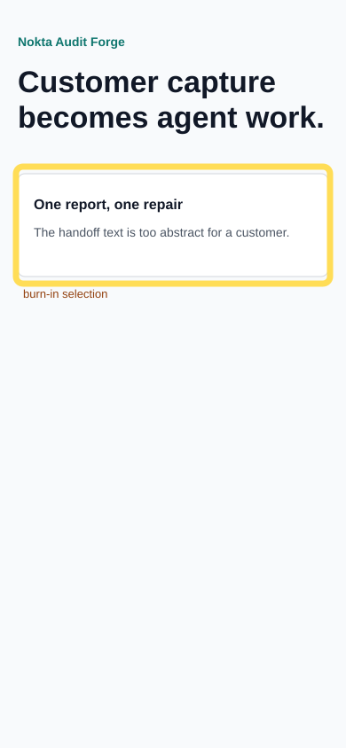

# Audit Report: Onboarding CTA Handoff

- Status: open
- Screen: Onboarding
- Reporter: beta-customer-01
- Timestamp: 2026-05-14T09:10:00+03:00
- Selection: x=18, y=188, w=354, h=132
- Type: feature request

## Customer note

The first screen says the report becomes agent work, but it does not show the exact handoff. I want one compact strip that explains: capture, hypothesis, repair.

## Agent input intent

Add a small customer-to-agent handoff element under the opening copy. Keep the audit widget removable and do not restructure navigation.
