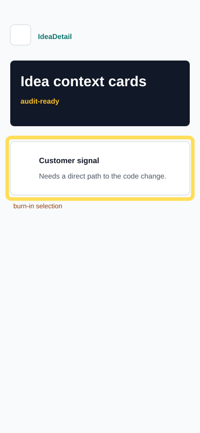

# Audit Report: Idea Detail Context

- Status: open
- Screen: IdeaDetail
- Reporter: beta-customer-01
- Timestamp: 2026-05-14T09:18:00+03:00
- Selection: x=14, y=268, w=362, h=120
- Type: feature request

## Customer note

When I open a request, I want to see how my sentence becomes a developer move. A detail page should show customer signal, forge hypothesis, and verify rule together.

## Agent input intent

Promote the handoff fields into the idea detail view. Keep the change to the detail screen and shared data only.
