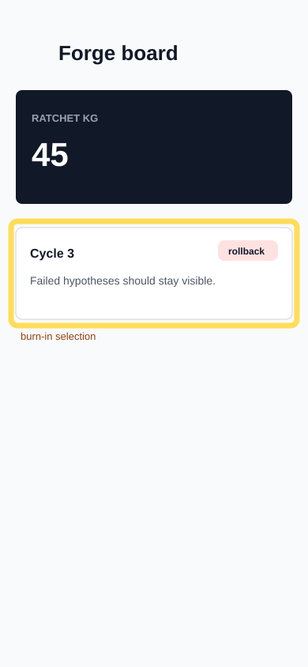

# Audit Report: Forge Dashboard Rollback Memory

- Status: open
- Screen: ForgeBoard
- Reporter: product-owner
- Timestamp: 2026-05-14T09:25:00+03:00
- Selection: x=14, y=280, w=362, h=132
- Type: feature request

## Customer note

The board should not hide failed hypotheses. If the agent tried a bad approach, I want that row visible next to successful cycles so the next cycle does not retry it.

## Agent input intent

Add visible rollback memory to the forge board. The first attempt may fail if the panel becomes too large; keep the accepted fix compact.
