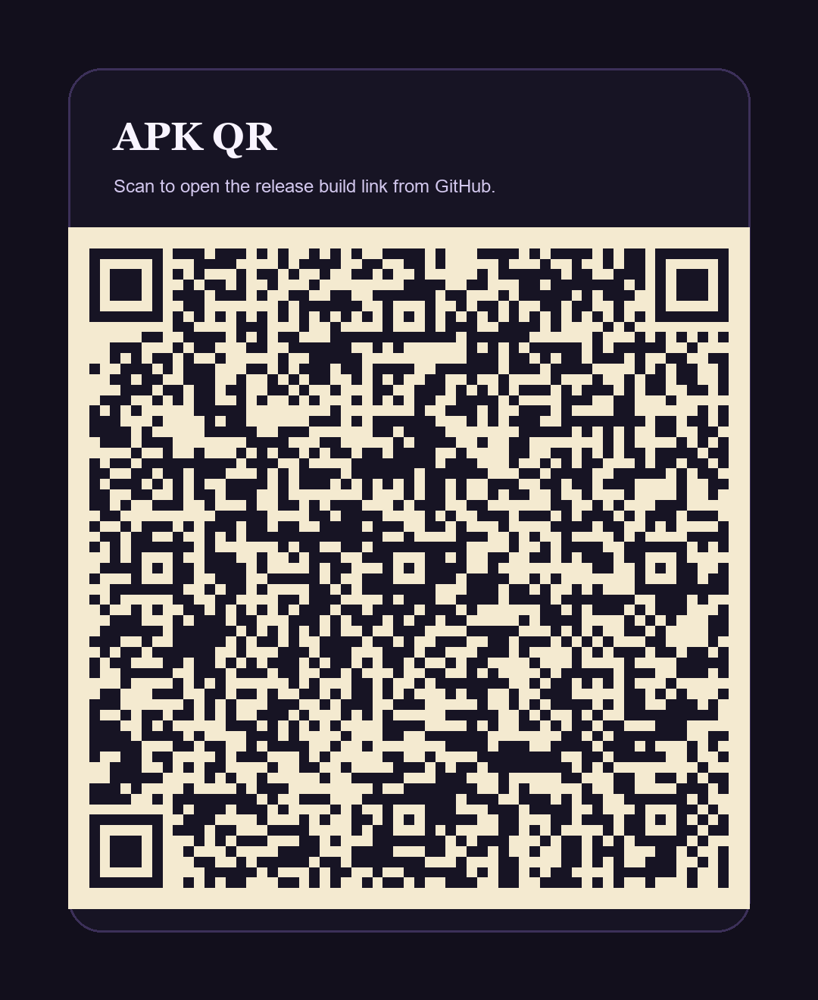

# 231118040 - SpecForge

## Track Selection

Chosen track: **Track 1**

Raw idea intake from text or voice transcript, AI-guided interview with 5 engineering questions, and one-page spec generation.

## Links

- Expo QR / APK install link: [app-release.apk](./app-release.apk)
- Direct GitHub APK link: [SpecForge APK](https://github.com/mehmetalisahingm/nokta/blob/implement/231118040-track1-specforge/submissions/231118040-specforge/app-release.apk?raw=1)
- 60-second demo video: [demo.mp4](./demo.mp4)
- Direct GitHub demo link: [SpecForge demo](https://github.com/mehmetalisahingm/nokta/blob/implement/231118040-track1-specforge/submissions/231118040-specforge/demo.mp4?raw=1)
- Demo poster: [demo-poster.png](./demo-poster.png)

## QR Code

The QR image below points to the release APK link in this repository.

## What I Built

SpecForge is an offline-first Expo app for Track 1. The app takes a rough idea as text or pasted voice transcript, asks 5 adaptive engineering questions, and generates a one-page spec that is structured enough to hand to an engineer, mentor, or evaluator.

The experience has three stages:

1. Capture the raw idea.
2. Run an engineering interview around problem, user, scope, constraints, and success signal.
3. Generate a one-page spec with traceable reasoning.

## Decision Log

- I selected **Track 1** because it maps cleanly to NOKTA's core metaphor: dot to structured page.
- I kept the app **offline-first** so the demo remains stable without API keys, backend setup, or live LLM dependencies.
- I supported **text and voice transcript intake** instead of full speech recognition to avoid brittle permissions and keep the MVP shippable inside one submission.
- I used **adaptive heuristics** to make the questions feel AI-shaped even in offline mode.
- I optimized the output for **buildability**, not inspiration: each generated section ties back to a captured user answer or an explicit assumption.
- I generated and committed a **local Android release APK** so the evaluator can install directly without rebuilding.
- I generated the **demo video and QR assets inside the submission folder** so the repo remains self-contained.

## Folder Contents

- [idea.md](./idea.md)
- [app/](./app)
- [app-release.apk](./app-release.apk)
- [demo.mp4](./demo.mp4)
- [expo-qr.png](./expo-qr.png)

