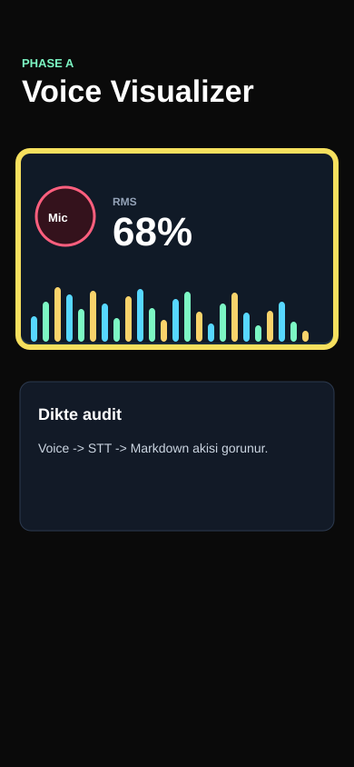

# Bug Raporu - SlopDetec Final Voice

**Tarih:** 22.05.2026 11:40  
**Toplam:** 1 not - 1 acik - 0 duzeltildi  
**Kaynak:** Dikte -> STT -> Markdown

---

## Ekran: Voice

### #1 - Mikrofon barlari sessizlikte sonmeli

- **Durum:** Acik
- **Zaman:** 22.05.2026 11:40
- **Raporlayan:** 231118044-voice-dictation
- **Secim:** x=20, y=166, w=350, h=216

## Dikte metni

Voice ekraninda mikrofonu actigimda barlar konusurken hizli tepki vermeli, ama sessizlikte tamamen sakinlesmeli. Bu ekran OpenAI voice-mode hissi vermeli; rastgele animasyon degil, RMS ve web FFT sinyalinden beslenen barlar olmali.

## Agent input

READ: Voice burn-in gorseli mikrofon kartini isaretliyor.  
LOCATE: `app/src/final/VoiceAvatarBridge.tsx` icindeki `useVoiceMeter` ve `LevelBars`.  
HYPOTHESIZE: 80ms native metering ve web `AnalyserNode` FFT ile gecikme hedefi korunur.  
EXPECTED: Sessizlikte opaklik duser, konusmada bar yukseklikleri canlanir.
