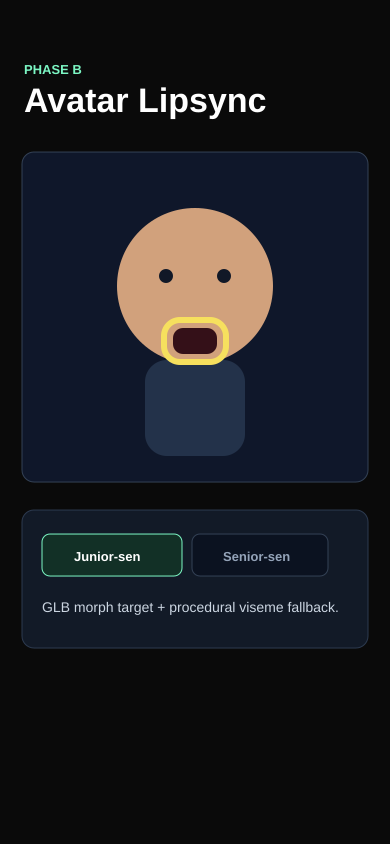

# Bug Raporu - SlopDetec Final Avatar

**Tarih:** 22.05.2026 12:00  
**Toplam:** 1 not - 1 acik - 0 duzeltildi  
**Kaynak:** Dikte -> STT -> Markdown

---

## Ekran: Avatar

### #1 - Dudak hareketi mikrofona bagli olmali

- **Durum:** Acik
- **Zaman:** 22.05.2026 12:00
- **Raporlayan:** 231118044-voice-dictation
- **Secim:** x=164, y=320, w=62, h=42

## Dikte metni

Avatar sahnesinde yalnizca 3D model gostermek yetmez. Ben konusurken agiz acilip kapanmali; Avaturn modelinde morph target varsa jawOpen veya viseme kanallari oynasin, modelde yoksa demo bos kalmasin diye procedural viseme fallback gorunsun.

## Agent input

READ: Burn-in agiz bolgesini isaretliyor.  
LOCATE: `AvatarModel`, `VisemeOverlay`, `ProceduralAvatar`.  
HYPOTHESIZE: GLB morph target taramasi ve overlay fallback birlikte kullanilirsa demo cihaz/model farkindan etkilenmez.  
EXPECTED: Mikrofon sinyali avatar agzina ayni anda yansir.
