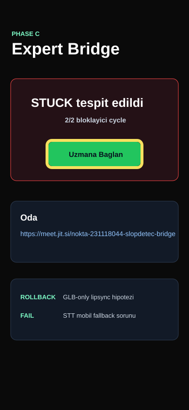

# Bug Raporu - SlopDetec Final Bridge

**Tarih:** 22.05.2026 12:20  
**Toplam:** 1 not - 1 acik - 0 duzeltildi  
**Kaynak:** Dikte -> STT -> Markdown

---

## Ekran: Bridge

### #1 - Iki bloklayici cycle uzmana baglanmali

- **Durum:** Acik
- **Zaman:** 22.05.2026 12:20
- **Raporlayan:** 231118044-voice-dictation
- **Secim:** x=97, y=289, w=196, h=56

## Dikte metni

Forge dongusunde agent iki kez ust uste fail veya rollback alirsa bunu kullanicinin eline bir hata olarak birakmasin. Uygulama Bridge ekranina gecsin ve tek butonla Jitsi goruntulu gorusme odasini acsin. Gorusmede ses, video ve ekran paylasimi ayni odada olabilmeli.

## Agent input

READ: Burn-in `Uzmana Baglan` butonunu isaretliyor.  
LOCATE: `getConsecutiveBlockCount`, `ForgeSignalPanel`, `ExpertBridgeScreen`.  
HYPOTHESIZE: Son iki cycle statusu SUCCESS degilse Bridge ekranina otomatik gecmek yeterli ve izlenebilir bir heuristiktir.  
EXPECTED: FAIL + ROLLBACK ardarda girildiginde aktif sekme Bridge olur.
