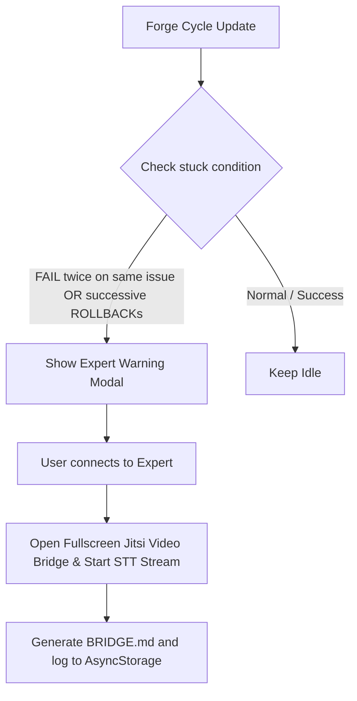

# Nokta Expert Bridge (Human-in-the-Loop Escalation)

The **Expert Bridge** is our advanced, Expo-compatible escalation system triggered automatically when the autonomous Forge cycle encounters a deadlock (`STUCK` or repeated `FAIL` states). It incorporates a premium real-time voice transcription pipeline that feeds runtime context directly back into the self-repair loop.

---

## 📞 Escalation Trigger Logic

---

## 🎙️ Real-Time Voice Transcription Pipeline

During an escalated Expert Bridge session, Nokta AI coordinates a **lightweight real-time transcription orchestration layer** designed to record peer-to-peer advisor speech patterns:

1. **Active STT Segments**: Dynamically parses live audio chunks, producing clean timestamped speech logs throughout the session.
2. **Auto-Scroll Stream View**: Renders the conversation stream inside a dark, glassmorphic container that keeps messages scrolling smoothly in real-time.
3. **AsyncStorage Persistence**: Saves completed session transcripts under `@bridge_transcript` for historical audits and offline reports.

---

## 🧠 Context-Aware Forge Recovery

When an Expert Bridge session terminates, Nokta AI automatically compiles the recommendation summaries under `@bridge_context_feed`:

* **Knowledge Propagation**: Re-injects expert recommendations directly into subsequent autonomous **Forge Cycles** as high-priority metadata (`contextSource`, `contextSummary`).
* **Timeline Integration**: Visualizes the active link between human guidance and autonomous repair directly inside the **Forge Timeline UI**, ensuring the repair agent acts on verified advisory feed data.

---

## 🏗️ Jitsi Room Web Bridge

To remain 100% compatible with Expo Go and avoid complex dev client dependencies, Jitsi sessions are escalated securely in a dedicated room:
* **Host Domain**: `meet.jit.si`
* **Room Pattern**: `NoktaExpertBridge_<session_id>`
* **Features**: Live Peer-to-Peer Audio, Video, Screen Share, and text chat.

---

## 💾 Call Persistence & Database
Every successful connection is logged under AsyncStorage key `@expert_bridges` and displays in your profile's connections timeline, detailing timestamps, trigger issues, transcripts, and meeting durations.
