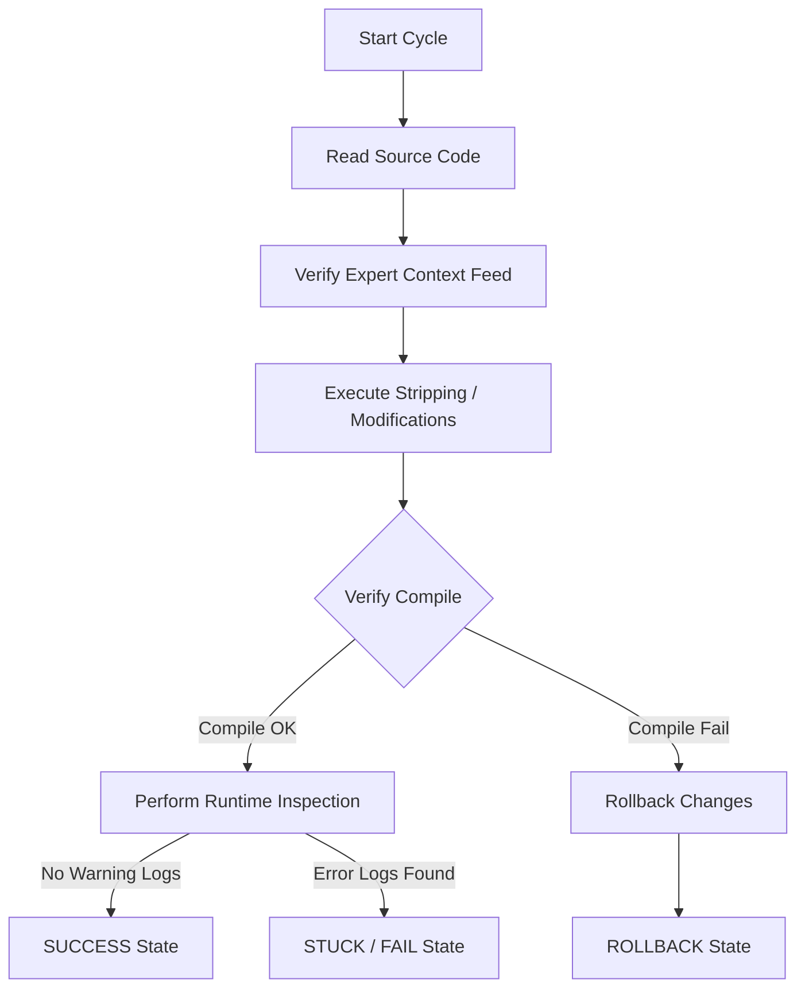

# Nokta Forge: Autonomous Development & Repair Cycles

The **Forge cycle** represents our structured, autonomous cycle logic for debugging, validation, and visual repairs. It features an advanced context-aware feedback loop that dynamically incorporates human expert insights collected during bridge sessions.

---

## 🔄 Forge Cycle Workflow

---

## 🧠 Context-Aware Self-Repair Loop

Nokta AI's autonomous agent utilizes a **lightweight real-time transcription orchestration layer** to digest advisor instructions:

1. **Context Extraction**: Upon completion of an Expert Bridge call, the synthesized recommendations (saved under `@bridge_context_feed`) are immediately queued.
2. **Metadata Injection**: The very next Forge cycle automatically pulls this context and appends it to its execution metadata (displaying as `contextSource` and `contextSummary`).
3. **Targeted Repairing**: The agent shifts its diagnostic heuristics based on expert direction (e.g., focusing on `morphTargetDictionary` viseme synchronization or specific AAPT image compliance adjustments).

---

## 🚦 Cycle Stage Definitions

| Stage | Accent Color | Trigger Condition |
| :--- | :--- | :--- |
| **SUCCESS** | Green / Cyan | Compiles with 0 warnings, GLTF parser validation logs 0 textures, and dynamic runtime mapping completes successfully. |
| **FAIL** | Red | Encountered major rendering/parsing failures or base64 warnings loop that couldn't be automatically fixed. |
| **ROLLBACK** | Orange | Instantly triggered if type-safety check (`tsc --noEmit`) fails, preserving the last stable build. |
| **STUCK** | Blue / Grey | Waiting for human approval, successive failures, or experiencing connection blocks with local bundlers. |

---

## 💾 Persistence & Audits
Nokta stores all past Forge cycles in AsyncStorage (`@forge_cycles`). It provides:
1. **Pristine History Tracking**: Seamless audit logs.
2. **Dynamic Dashboard Rendering**: Rendered inside the profile dev suite featuring linked Expert Bridge context badges.
