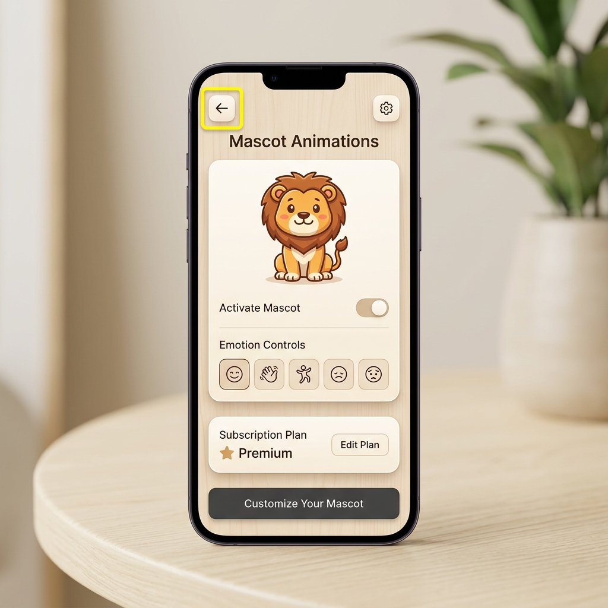

# Nokta Audit Report: Detay Ekranı Geri Dönüş Yönlendirme Hatası

## 📋 Denetim Bilgileri
- **Ekran Adı (ScreenName):** `/ideas/[id]`
- **Raporlayan (Reporter ID):** `231118056-sibel-yeter`
- **Rol (Reporter Role):** `Müşteri / QA`
- **Zaman Damgası (Timestamp):** `2026-05-18T19:30:11.820Z`

---

## 🔍 Hata / Gereksinim Detayları

### Sorun Açıklaması
Fikir detay ekranında sol üstte yer alan geri dönüş (sol ok) butonuna tıklandığında, eğer kullanıcı ekrana harici bir linkle veya derin bağlantıyla (deep link) ulaştıysa geçmiş (navigation history) bulunmadığından buton işlevsiz kalıyor ve kullanıcı ana ekrana geri dönemiyor.

### Beklenen Davranış
Geçmiş kaydının olmadığı durumlarda geri butonunun otomatik olarak `/ideas` tabına (Fikir havuzu) yönlendirme yapacak şekilde güvenli (fallback) mekanizmaya sahip olması gerekir.

---

## 📌 İşaretleme Koordinatları (Highlight Bounds)
- **X:** `16 px`
- **Y:** `24 px`
- **Genişlik (Width):** `40 px`
- **Yükseklik (Height):** `40 px`

---

## 📸 Görsel Kanıt (Burn-in Screenshot)

