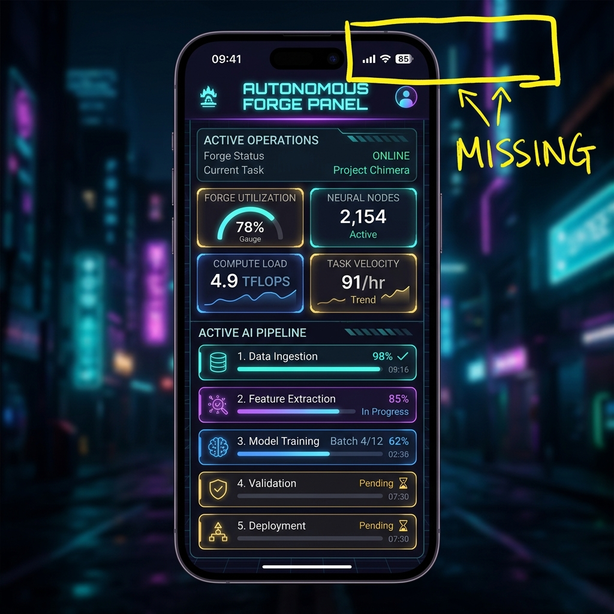

# Nokta Audit Report: Agent Paneli Bağlantı Durumu Gösterge Eksikliği

## 📋 Denetim Bilgileri
- **Ekran Adı (ScreenName):** `/agent`
- **Raporlayan (Reporter ID):** `231118056-sibel-yeter`
- **Rol (Reporter Role):** `Müşteri / QA`
- **Zaman Damgası (Timestamp):** `2026-05-18T19:45:05.110Z`

---

## 🔍 Hata / Gereksinim Detayları

### Sorun Açıklaması
Otonom Forge Agent kontrol panelinde, sistemin aktif çalışıp çalışmadığını, otonom döngünün veya ağ bağlantısının durumunu görsel olarak bildiren canlı bir indikatör bulunmuyor. Kullanıcı, agent'ın arka planda bağlı veya aktif olup olmadığını anlık olarak takip edemiyor.

### Beklenen Davranış
Panelin sol üst köşesinde veya uygun bir alanda, otonom döngünün durumunu belirten yanıp sönen bir yeşil/kırmızı canlı sinyal (pulse dot) ve "Agent Otonom Döngü: AKTİF" gibi bir metin yer almalıdır.

---

## 📌 İşaretleme Koordinatları (Highlight Bounds)
- **X:** `280 px`
- **Y:** `20 px`
- **Genişlik (Width):** `60 px`
- **Yükseklik (Height):** `20 px`

---

## 📸 Görsel Kanıt (Burn-in Screenshot)

