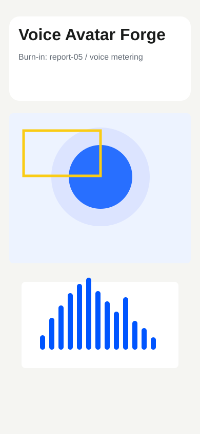

# Audit Report 05 - Voice Avatar Metering

**Screen:** `voiceAvatar`

## Voice Dictated Audit Note

Mikrofona konusunca barlar hemen ziplamali ve avatar dudaklari ayni ritimde
hareket etmeli. Sessizlikte enerji sonmeli; gecikme demo icin 200ms altinda
hissedilmeli.

## Forge Input

- READ: voice screen and avatar renderer.
- LOCATE: microphone metering, band envelope, GLB lipsync.
- HYPOTHESIZE: RMS-driven bands and morph targets make the customer voice visible.
- REPAIR: add `VoiceAvatarScreen`, `VoiceBars`, and `AvatarScene`.
- TEST: `npm run typecheck`.
- VERIFY: manual emulator check with microphone permission.

## Expected Outcome

Voice energy is visible without opening a separate tool, and the avatar remains
silent when there is no microphone input.
