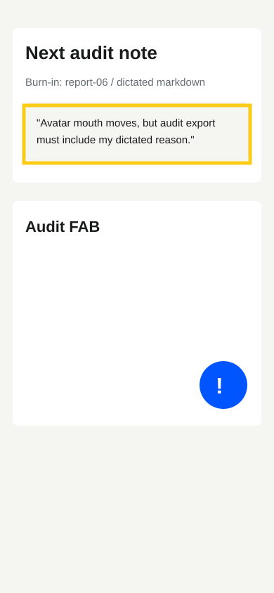

# Audit Report 06 - Dictated Audit Note

**Screen:** `voiceAvatar`

## Voice Dictated Audit Note

Audit raporunu elle yazmak istemiyorum. Once notumu dikte edeyim, sonra
AuditWidget export ettiginde markdown icine otomatik dusmeli.

## Forge Input

- READ: audit host adapter and voice note state.
- LOCATE: `audit-deps.tsx` markdown write path.
- HYPOTHESIZE: a pending dictated note can be appended to markdown without
  changing the drop-in widget package.
- REPAIR: add AsyncStorage-backed pending audit voice note injection.
- TEST: `npm run typecheck`.
- VERIFY: exported markdown contains `Voice Dictated Audit Note`.

## Expected Outcome

The audit widget stays drop-in, while the host app enriches exported reports
with dictated customer intent.
