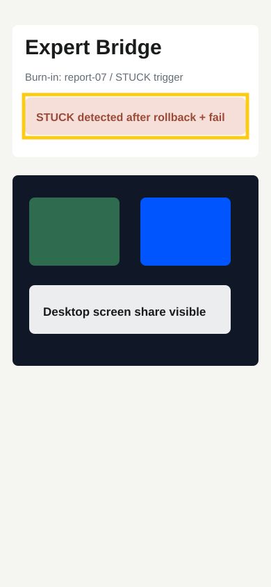

# Audit Report 07 - STUCK Expert Bridge Trigger

**Screen:** `bridge.expertCall`

## Voice Dictated Audit Note

Forge iki cycle ust uste rollback veya fail olursa artik sadece log tutmasin.
Uygulama bana Uzmana Baglan butonu gostersin ve Jitsi odasini acsin.

## Forge Input

- READ: forge ledger and local server.
- LOCATE: cycle result normalization and app bridge status polling.
- HYPOTHESIZE: consecutive rollback/fail rows are enough to create a STUCK state.
- REPAIR: add `/bridge/status`, `/bridge/transcript`, and Jitsi WebView screen.
- TEST: `npm run typecheck`.
- VERIFY: bridge state returns a deterministic room URL.

## Expected Outcome

The customer-developer loop gets a human escalation path when autonomy stalls.
