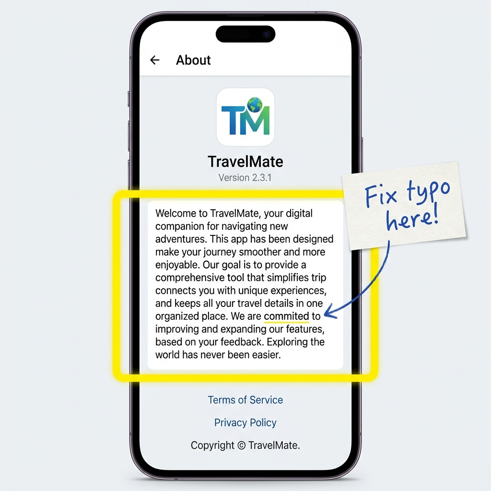

# Audit Report: About Screen Typo

**Screen:** About
**Timestamp:** 2026-05-20T17:37:00Z
**Reporter:** Tester1 (via Nokta Audit Widget)

## Observation
There's a typo in the main description text on the About screen. It should say something more professional than "This is an app demonstrating the Audit Widget". Actually, wait, let's say the text should be localized or slightly more descriptive. Let's make it say "This is an application specifically designed for demonstrating the Nokta Audit Widget capabilities."

## Screenshot

## Recommendation
Update the text string to: "This is an application specifically designed for demonstrating the Nokta Audit Widget capabilities."
